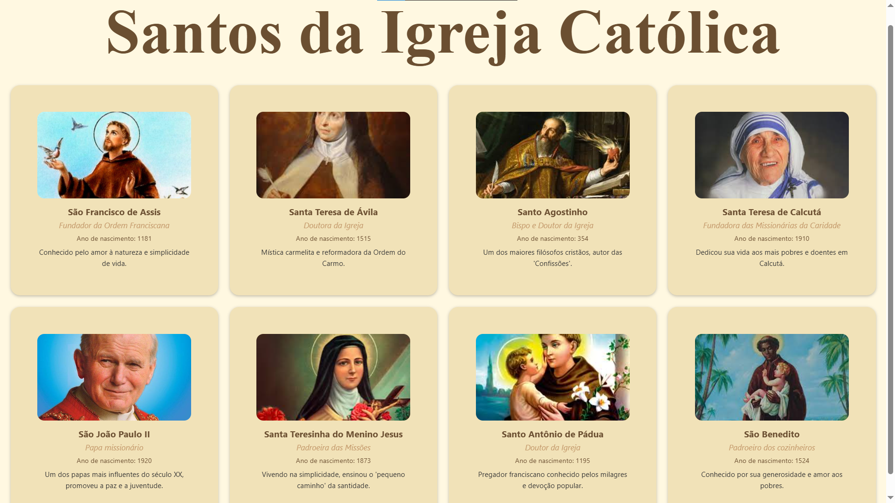

# 📖 Meu Catálogo Pessoal – Santos da Igreja Católica

Um aplicativo simples desenvolvido em **React Native com Expo**, que exibe um catálogo de **Santos da Igreja Católica** em formato de cards.  
Cada card contém a **imagem**, **nome**, **informações principais** e uma **breve descrição** sobre a vida do santo.

---

## 📱 Demonstração



---

## 🛠️ Tecnologias Utilizadas

<div style="display: flex; gap: 10px;">
  
  
  
  
</div>

---

## 📂 Estrutura do Projeto

```
meu-catalogo/
│── catalogo.json          # Dados do catálogo (id, título, subtítulo, ano, imagem, descrição)
│── app/
│   └── index.tsx          # Arquivo principal que chama a tela CatalogoScreen
│── components/
│   └── CatalogoScreen.tsx # Tela principal do catálogo (renderização e estilização)
```

---

## ⚙️ Como Executar o Projeto

1. Clone este repositório:
   ```bash
   [git clone https://github.com/seu-usuario/meu-catalogo.git](https://github.com/Ligia-Costa/catalogo---pessoal.git)
   ```
2. Acesse a pasta do projeto:
   ```bash
   cd meu-catalogo
   ```
3. Instale as dependências:
   ```bash
   npm install
   ```
4. Inicie o servidor Expo:
   ```bash
   npx expo start
   ```
5. Abra no **Expo Go** (Android/iOS) ou rode em um **emulador**.

---

## ✨ Funcionalidades

- 📸 Exibição de **imagem do santo**  
- 📝 Informações principais (nome, subtítulo, ano de nascimento e descrição)  
- 🎨 Estilização com **Flexbox e StyleSheet**  
- 📂 Dados vindos de um arquivo **JSON externo**  

---

## 🎨 Paleta de Cores Utilizada

- Creme claro: `#FFF8E1`  
- Bege suave: `#F1E2B8`  
- Dourado suave: `#FFD700`  
- Caramelo: `#C49A6C`  
- Marrom suave: `#6B4F31`  
- Cinza claro: `#D1D1D6`  

---

## 📜 Licença

Este projeto é apenas para fins educacionais.  
Inspirado no aprendizado de **React Native com Expo**.  
